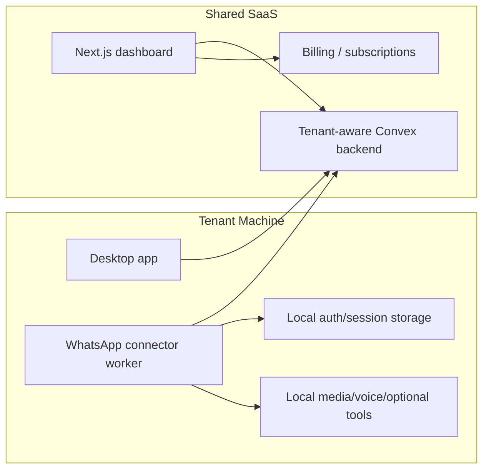

# Multi-Tenant Desktop Connector Plan

Status: planning document  
Current decision: Cloudflare is not part of the core architecture. The product should use a shared multi-tenant dashboard/backend and a tenant-local desktop connector for WhatsApp.

## Goal

Build Odogwu HQ as a multi-tenant SaaS control plane while keeping WhatsApp connection and Baileys session state on each tenant's own machine.

The target architecture is:

1. **Shared dashboard**
   - One hosted multi-tenant Next.js dashboard.
   - Tenants log in, manage settings, review queues, see conversations, configure automation, view health, and manage billing.

2. **Shared Convex backend**
   - One tenant-aware Convex backend stores product state.
   - Every product table is tenant-scoped.
   - Convex is the source of truth for threads, messages, drafts, outbox, settings, telemetry, connector state, and billing-related usage records.

3. **Tenant desktop connector**
   - A downloadable app runs on the tenant's machine.
   - The connector owns WhatsApp/Baileys login, `.wa_auth`, local media tools, local process supervision, and any local-only optional tooling.
   - The connector connects outbound to the shared backend.
   - The connector claims only jobs for its tenant.

4. **Optional official hosted connectors**
   - For tenants using official WhatsApp Business Platform / Cloud API, the connector can be hosted server-side because it is HTTP/webhook based.
   - This is separate from personal WhatsApp/Baileys support.

## Why Cloudflare Drops Out

The main production risk is not whether JavaScript can run in Cloudflare Workers. The risk is centralizing many unrelated customer WhatsApp Web sessions behind shared infrastructure. Even if multiple Baileys sessions technically run somewhere, WhatsApp could correlate unrelated tenants by shared IP/network, host behavior, timing, and automation fingerprints.

Therefore:

- Do not run many customer Baileys sessions on one local machine.
- Do not run many customer Baileys sessions on one shared VPS.
- Do not run many customer Baileys sessions behind shared Cloudflare egress.
- Do not make Cloudflare Workers part of the core WhatsApp connector path.
- Keep WhatsApp session ownership on the tenant's machine by default.

Cloudflare can be reconsidered later for unrelated infrastructure, but it is not needed for the core multi-tenant product.

## Documentation Read

Local project instructions:

- `AGENTS.md`
- `convex/_generated/ai/guidelines.md`
- `README.md`
- `convex/README.md`
- `docs/reference/dependencies.md`
- `docs/reference/environment.md`
- `docs/reference/http-api.md`

Local framework/package docs and metadata:

- Next.js 16 docs in `node_modules/next/dist/docs/`
  - Route Handlers
  - Edge Runtime constraints
  - Deployment adapters
  - Authentication
  - `serverExternalPackages`
- Package READMEs / metadata for:
  - `@azure-rest/ai-inference`
  - `@azure/core-auth`
  - `@splinetool/react-spline`
  - `@xenova/transformers`
  - `baileys`
  - `clsx`
  - `convex`
  - `convex-helpers`
  - `date-fns`
  - `instagram-private-api`
  - `next`
  - `pdf-parse`
  - `pino`
  - `qrcode`
  - `react`
  - `react-dom`
  - `zod`
  - `tailwindcss`
  - `@tailwindcss/postcss`
  - `typescript`
  - `eslint`
  - `concurrently`

External/current docs checked during planning:

- Cloudflare Workers Next.js/OpenNext guide
- Cloudflare Workers Node.js compatibility
- Cloudflare Durable Objects overview
- Cloudflare Queues overview
- Cloudflare Workers storage options
- OpenNext Cloudflare adapter docs
- Convex docs on indexes/auth where relevant

Those Cloudflare docs are now background research only. The current plan does not require Cloudflare.

## Core Architecture



## Runtime Responsibilities

### Shared Dashboard

Relevant files:

- `src/app/*`
- `src/app/api/**/route.ts`
- `src/components/*`
- `src/lib/*`
- `proxy.ts`

Responsibilities:

- Login and tenant selection.
- Tenant onboarding.
- Desktop connector pairing.
- Queue review and approval.
- Conversation views.
- Rules/settings/style/profile management.
- Connector health/version display.
- Billing/subscription management.

Changes needed:

- Replace single-instance assumptions with tenant-aware UI and API contracts.
- Keep local dev mode working for one owner.
- Stop assuming the dashboard server can directly restart a tenant's local WhatsApp worker in SaaS mode.
- Add commands that request the desktop connector to act instead of using local server process control.

### Convex Backend

Relevant files:

- `convex/schema.ts`
- `convex/outbox.ts`
- `convex/inbound.ts`
- `convex/draft.ts`
- `convex/system.ts`
- `convex/settings.ts`
- `convex/crons.ts`

Responsibilities:

- Tenant-aware product state.
- Authorization and membership checks.
- Outbox jobs claimed by tenant desktop connectors.
- Connector registration, heartbeat, and revocation.
- Runtime settings and automation policy.
- Usage metering records.

Changes needed:

- Add tenant tables.
- Add `tenantId` to product tables via widen-migrate-narrow.
- Add tenant-prefixed indexes.
- Add connector-token auth path.
- Ensure no cross-tenant reads are possible through public functions.

### Tenant Desktop Connector

Relevant existing files:

- `src/worker/index.ts`
- `src/worker/instagram.ts`
- `src/worker/supervisor.ts`
- `src/worker/ai.ts`
- `src/worker/stt.ts`
- `src/worker/voice-note.ts`
- `src/worker/local-embeddings.ts`
- setup managers in `src/lib/*-setup/session.ts`

Responsibilities:

- Pair with a tenant account.
- Store connector token locally.
- Own WhatsApp pairing and `.wa_auth` locally.
- Claim tenant-scoped outbox jobs.
- Ingest tenant WhatsApp events into Convex.
- Send approved/automatic replies through the tenant's local WhatsApp session.
- Report heartbeat, version, capabilities, and errors.
- Run optional local media, voice, embedding, or subprocess tools.

Packaging direction:

- Start by reusing the current Bun/Node worker and setup flow.
- Then package it behind a desktop shell.
- Desktop shell can be Electron, Tauri, or another desktop wrapper after a separate packaging decision.
- Keep the connector itself as a headless process/service so it can be supervised and tested independently.

## Multi-Tenant Data Model

### New tables

Add these first:

- `tenants`
  - `slug`
  - `name`
  - `plan`
  - `billingCustomerId`
  - `createdAt`
  - `updatedAt`
  - indexes: `by_slug`, `by_updatedAt`, `by_billingCustomerId`
- `tenantMembers`
  - `tenantId`
  - `identityTokenIdentifier`
  - `role`: `owner`, `admin`, `member`, `viewer`
  - `createdAt`
  - `updatedAt`
  - indexes: `by_identityTokenIdentifier`, `by_tenantId_and_identityTokenIdentifier`, `by_tenantId_and_role`
- `connectorInstalls`
  - `tenantId`
  - `installId`
  - `displayName`
  - `platform`: `macos`, `windows`, `linux`, `unknown`
  - `appVersion`
  - `status`: `paired`, `online`, `offline`, `revoked`, `error`
  - `lastSeenAt`
  - `createdAt`
  - `updatedAt`
  - indexes: `by_tenantId_and_installId`, `by_installId`, `by_status_and_lastSeenAt`
- `connectorTokens`
  - Prefer storing only token hashes.
  - `tenantId`
  - `installId`
  - `tokenHash`
  - `status`: `active`, `revoked`, `expired`
  - `expiresAt`
  - `createdAt`
  - `updatedAt`
  - indexes: `by_tokenHash`, `by_tenantId_and_installId`, `by_status_and_expiresAt`
- `connectorPairingCodes`
  - Store only code hashes.
  - `tenantId`
  - `codeHash`
  - `expiresAt`
  - `usedAt`
  - `createdAt`
  - indexes: `by_codeHash`, `by_tenantId_and_expiresAt`
- `usageEvents`
  - `tenantId`
  - `kind`: `ai_tokens`, `message_ingest`, `message_send`, `media_generation`, `connector_minutes`, etc.
  - `quantity`
  - `metadata`
  - `createdAt`
  - indexes: `by_tenantId_and_createdAt`, `by_kind_and_createdAt`

### Existing tables needing `tenantId`

Every product-state table should become tenant-scoped:

- `appConfig`
- `threads`
- `callSessions`
- `messages`
- `messageEmbeddings`
- `conversationSignals`
- `threadConversationState`
- `threadTopicLanes`
- `threadMemory`
- `contactMemoryFacts`
- `replyDrafts`
- `outbox`
- `inboundDedupeKeys`
- `aiFeedbackSignals`
- `aiOutcomes`
- `aiCandidateEvals`
- `aiTuningProfiles`
- `aiBackfillJobs`
- `followUps`
- `todoCandidates`
- `todos`
- `styleProfiles`
- `styleProfileHistory`
- `personalityProfiles`
- `personalityProfileVersions`
- `threadPersonalitySettings`
- `relationshipThreadState`
- `ignoreRules`
- `guardrailEvents`
- `providerRuns`
- `toolRuns`
- `systemEvents`
- `setupRuntime`
- `messageReactions`
- `mediaAssets`
- `threadGrounding`
- `backlogThreadState`
- `romanceMorningState`

### Index pattern

Add tenant-prefixed indexes matching existing access patterns:

- `threads.by_tenantId_and_provider_and_jid`
- `threads.by_tenantId_and_provider_and_lastMessageAt`
- `messages.by_tenantId_and_thread_messageAt`
- `replyDrafts.by_tenantId_and_status`
- `outbox.by_tenantId_and_messageProvider_and_status_sendAt`
- `appConfig.by_tenantId_and_key`
- `ignoreRules.by_tenantId_and_target`
- `systemEvents.by_tenantId_and_createdAt`
- `providerRuns.by_tenantId_and_createdAt`

Keep existing indexes during the widening phase. Remove non-tenant indexes only after code is fully migrated and admin/global use cases are clear.

## Auth And Pairing

### Human user auth

Use real SaaS auth for the shared dashboard:

- Add `convex/auth.config.ts`.
- Use `ctx.auth.getUserIdentity()`.
- Use `identity.tokenIdentifier` as the canonical identity key.
- Never accept `userId` or tenant membership as trusted client args.
- Resolve tenant membership server-side.

### Desktop connector auth

Flow:

1. Tenant opens dashboard.
2. Dashboard creates a short-lived single-use pairing code.
3. Tenant opens desktop app and enters/scans the code.
4. Desktop app exchanges pairing code for a connector token.
5. Connector stores token locally.
6. Connector uses token for heartbeats, job claiming, and ingest/send operations.
7. Tenant can revoke the install from dashboard.

Rules:

- Pairing codes are short-lived and single-use.
- Store only pairing code hashes server-side.
- Store only connector token hashes server-side.
- Scope token to `tenantId`, `installId`, provider, and capabilities.
- Rotate connector tokens periodically.
- Connector tokens must not grant dashboard access.

## Desktop Connector Runtime Abstractions

Create interfaces before packaging:

```ts
export type RuntimeKind = "desktop" | "local-dev";

export type ConnectorCapabilities = {
  whatsapp: boolean;
  instagram: boolean;
  mediaProcessing: boolean;
  voiceTranscription: boolean;
  voiceGeneration: boolean;
  localEmbeddings: boolean;
  codexFallback: boolean;
  openClaw: boolean;
};
```

Core abstractions:

- `TenantContext`
  - `tenantId`
  - `tenantSlug`
  - `installId`
  - `provider`
  - `workerId`
- `ConnectorAuthStore`
  - local encrypted token/session storage where possible
- `ConnectorStateStore`
  - local `.slm` equivalent scoped to tenant/install
- `ProviderConnector`
  - WhatsApp connector
  - Instagram connector if retained
  - official WhatsApp Business connector if added
- `ConnectorTransport`
  - calls Convex/control APIs
  - reports heartbeat
  - claims jobs
  - acknowledges commands
- `RuntimeLogger`
  - local structured logs with redaction

Rule: connector business logic should not depend directly on desktop UI APIs. The desktop app supervises and configures the connector; the connector remains testable as a headless process.

## Full Desktop App Packaging Preparation

The desktop app can be packaged Cursor-style: one large installable application that contains the UI, a local server/API layer, the connector worker, local assets, and runtime dependencies. The only required remote dependency is the shared backend.

This is different from a small connector companion. The tenant should feel like they installed Odogwu HQ, not a helper daemon.

Prepare the repo by separating the current app into three layers:

1. **Shared product/backend layer**
   - Convex functions and schema.
   - Tenant-aware API contracts.
   - Shared validation/types.
   - No desktop shell imports.

2. **Local app runtime layer**
   - Embedded local server that serves the desktop UI and local setup/API routes.
   - Owns local-only route handlers such as WhatsApp setup, local logs, local restart, and local media tooling.
   - Talks to Convex for shared tenant state.

3. **Connector service layer**
   - Headless worker process that can be run from CLI, desktop shell, or tests.
   - Owns WhatsApp/Instagram sessions and local-only tools.
   - Has no dependency on React or dashboard components.

4. **Desktop shell layer**
   - Native window, tray/menu, notifications, local setup UX, update UX, and connector supervisor.
   - Starts/stops the embedded local app runtime and connector service.
   - Loads the local UI, not a remote website.
   - Talks to local runtime/connector over IPC/HTTP/stdout.

### Cursor-style target shape

The packaged app should include:

- Desktop shell.
- Built dashboard UI.
- Embedded local API/server runtime.
- Headless connector worker.
- WhatsApp setup/session manager.
- Local auth/session storage.
- Static assets and styles.
- Required JS runtime or bundled executable.
- Optional local binaries that are approved for bundling.
- Update/checksum metadata.

The packaged app should not include:

- The Convex deployment itself.
- Tenant production data beyond local connector/session state.
- Shared SaaS secrets.
- Other tenants' data or sessions.

### Packaging option recommendation

Start with **Electron + embedded local app runtime + connector sidecar** if speed matters most:

- Electron bundles Chromium and Node, so it is friendlier to the current Next/React/Bun/Node-heavy stack.
- Electron packaging and auto-update paths are mature; official Electron docs describe auto-update options, and Electron Forge documents update workflows with the caveat that signed macOS apps are required for auto-update. 
- The tradeoff is a larger app.
- This best matches the Cursor-style “one big app” model.

Consider **Tauri + connector sidecar** later if app size and native feel matter more:

- Tauri v2 supports sidecar binaries through `externalBin`, which fits a compiled connector process.
- Tauri's Next.js flow is friendlier when the UI is static/exported. Because this project uses local route handlers and server behavior, Tauri likely needs a sidecar local server for the full app.
- The tradeoff is more Rust/Tauri packaging work and stricter frontend constraints.

Use **Bun executable builds** for the headless connector if compatible:

- Bun supports standalone executable builds and cross-compilation via `bun build --compile`.
- This can let the desktop shell bundle a connector binary without requiring the tenant to install Bun.
- Validate dependencies carefully because native addons, dynamic files, local binaries, and package runtime assumptions may need special handling.

### Full app local runtime choices

There are two viable ways to package the app UI:

1. **Embedded Next server**
   - Build the Next app for production.
   - Package the production server output and start it on `127.0.0.1:<ephemeral-port>` from the desktop shell.
   - Electron loads that local URL.
   - Best preserves current route handlers and local setup APIs.
   - Bigger and more operationally complex, but closest to the current app.

2. **Static desktop UI + local connector API**
   - Export/build a static desktop UI.
   - Move local server behaviors into a dedicated connector/local API process.
   - Electron/Tauri loads local files.
   - Smaller and cleaner long-term.
   - Requires more refactor because current Next route handlers provide important local behavior.

Recommended first path: embedded Next server. Refactor toward static desktop UI only after the product surface is stable.

### Repo preparation checklist

- Create a connector entrypoint that does not assume it is launched by `bun run worker`.
  - Suggested path: `src/connector/index.ts`.
  - It should accept config from env, flags, or a local config file.
  - It should expose lifecycle events: `starting`, `pairing`, `connected`, `claiming`, `sending`, `error`, `stopped`.

- Move local-only state behind stores:
  - `ConnectorAuthStore` for `.wa_auth` / `.ig_auth`.
  - `ConnectorConfigStore` for tenant/install config.
  - `ConnectorSecretStore` for connector token.
  - Use OS keychain later where available; keep file fallback for dev.

- Make all local paths tenant/install scoped:
  - `.odogwuhq/<installId>/config.json`
  - `.odogwuhq/<installId>/wa_auth`
  - `.odogwuhq/<installId>/ig_auth`
  - `.odogwuhq/<installId>/logs`
  - `.odogwuhq/<installId>/tmp`

- Split worker process control from dashboard route handlers:
  - Current setup/restart routes can keep working in local dev.
  - SaaS mode should send commands to the connector through Convex/control records.
  - Desktop shell should own local start/stop/restart.

- Add a desktop app bootstrap:
  - allocate an available localhost port
  - start the embedded local app runtime
  - start the connector service
  - wait for `/health`
  - open the desktop window to the local app URL
  - shut down child processes cleanly on quit

- Add a desktop mode flag:
  - `ODOGWU_DESKTOP=1`
  - hide hosted-only controls
  - enable local setup controls
  - show connector status in the app chrome
  - use local runtime endpoints for machine operations

- Add a local connector API:
  - `GET /health`
  - `GET /status`
  - `POST /pair`
  - `POST /whatsapp/start`
  - `POST /whatsapp/stop`
  - `POST /logs/export`
  - Or equivalent IPC methods if using Electron/Tauri IPC.

- Add a local app runtime API:
  - `GET /desktop/health`
  - `GET /desktop/runtime`
  - `POST /desktop/open-dashboard`
  - `POST /desktop/restart-connector`
  - `POST /desktop/export-diagnostics`
  - These can wrap existing setup/runtime route logic but should be isolated from hosted SaaS mode.

- Add backend connector APIs/functions:
  - create pairing code
  - redeem pairing code
  - revoke connector
  - heartbeat
  - claim outbox
  - mark send result
  - report setup status
  - report version/capabilities

- Extract dashboard-only code from connector imports:
  - The connector should not import `next`, React components, `next/headers`, or route handlers.
  - Shared logic should live in `shared/*` or connector-safe `src/lib/*`.
  - Node-only helpers should be clearly named and isolated.

- Audit external binaries:
  - `ffmpeg`
  - `ffprobe`
  - `whisper.cpp`
  - VoxCPM/Python path
  - Codex CLI
  - OpenClaw CLI
  - Decide which are bundled, optional, downloaded during setup, or unsupported in the first desktop build.

- Add build targets:
  - `connector:dev`
  - `connector:build`
  - `desktop:dev`
  - `desktop:build:next`
  - `desktop:build:connector`
  - `desktop:build`
  - `desktop:package`
  - `desktop:release`

- Add packaging manifest/config:
  - app name, app id, icons
  - bundled local server files
  - connector sidecar path
  - allowed local ports / URL loading policy
  - OS permissions
  - code-signing identities

- Add signing/release preparation:
  - macOS Developer ID certificate and notarization.
  - Windows code-signing certificate.
  - Linux AppImage/deb/rpm decision.
  - Auto-update channel metadata.
  - Crash/log export flow.

### Desktop app UX scope

The desktop app can include the full product UI, but it should distinguish local machine operations from shared tenant state.

First version should include:

- Sign in / pairing code entry.
- Connector online/offline status.
- WhatsApp pairing QR or pairing-code flow.
- Current tenant/account identity.
- Start/stop/restart connector.
- Log export.
- Version/update status.
- Full queue/conversation/settings views backed by Convex.
- Optional link/open hosted dashboard for account/billing/admin views.

The hosted dashboard can remain available for account admin, billing, and remote review, but the tenant should be able to do the normal daily workflow inside the packaged desktop app.

### Offline behavior

The connector should be useful but conservative when offline:

- It can keep WhatsApp session alive locally.
- It can queue local status/telemetry until backend reconnects.
- It should not send new AI-generated replies without backend policy/state unless explicitly configured for a future offline mode.
- It should never lose send results; persist local send receipts until Convex acknowledges them.

### Release artifact target

Each release should produce:

- macOS arm64/x64 signed app.
- Windows x64 signed installer.
- Linux x64 AppImage or deb.
- Connector binary artifacts if packaged separately.
- Embedded app runtime artifacts.
- Checksums.
- Release notes.
- Update metadata.

### First packaging spike

Before implementing full packaging, run a one-week spike:

1. Extract a minimal connector entrypoint.
2. Build the Next app and start it from a desktop bootstrap on an ephemeral local port.
3. Compile or bundle the connector for the current development machine.
4. Build a desktop shell that opens the local app runtime, not a remote URL.
5. Prove sign-in/pairing works from the packaged window.
6. Prove WhatsApp QR pairing works inside the supervised connector.
7. Prove the connector can claim one Convex outbox job and mark it sent.
8. Prove logs and auth survive app restart.
9. Measure package size and startup reliability.

### Packaging implementation status

Initial desktop packaging scaffolding is now in place:

- Electron bootstrap: `src/desktop/main.mjs`
- Electron Builder config: `electron-builder.yml`
- Package entrypoint: `package.json` `main`
- Development scripts:
  - `desktop:dev`
  - `desktop:dev:no-worker`
- Package scripts:
  - `desktop:build:next`
  - `desktop:build:connector`
  - `desktop:package`
  - `desktop:dist`
- Desktop runtime state directory support via `SLM_DATA_DIR`
- Desktop-local WhatsApp auth directory via `WHATSAPP_AUTH_PATH`
- Desktop-local Instagram auth directory via `INSTAGRAM_AUTH_PATH`
- Desktop-local embeddings cache via `SLM_EMBEDDINGS_CACHE_DIR`

Current limitation: the first scaffold still launches the local app runtime and connector through Bun. The next implementation pass should replace that with a bundled runtime strategy so installed tenant machines do not need Bun preinstalled. The two practical options are:

- Bundle a Node runtime plus the standalone Next server output and connector process.
- Compile the connector into a standalone binary and keep the UI as a local packaged web runtime.

## WhatsApp Deployment Rules

Recommended launch path:

- Personal WhatsApp / Baileys tenants use the desktop connector.
- WhatsApp auth stays on the tenant's machine.
- Sends happen from the tenant's local WhatsApp session.
- Shared backend stores product state, not the raw WhatsApp Web session.

Avoid:

- Shared hosted Baileys pool.
- Many unrelated tenants on one host/IP.
- Moving `.wa_auth` into shared cloud storage for default SaaS.

Business alternative:

- Tenants who can use official WhatsApp Business Platform can use a hosted HTTP/webhook connector.
- This can be a premium plan and does not require Baileys.

## Billing Model

Yes, tenants can still pay even when the connector runs on their machine. The downloaded app should ask every tenant to choose one of two modes during setup:

- **Managed backend**
  - 7 day trial.
  - ₦5,000 per month after trial.
  - Tenant keeps WhatsApp on their machine.
  - You host the shared Convex/backend, AI control plane, updates, and support.
- **Self-hosted**
  - No required subscription to your hosted backend.
  - Tenant provides their own Convex/backend URL.
  - Tenant provides their own AI endpoint, model, and API key.
  - Tenant is responsible for their own servers, keys, backups, and usage costs.

In the managed plan, tenants are paying for the shared intelligence and control plane:

- Dashboard access.
- Multi-tenant Convex backend state.
- AI reply generation.
- Memory/style/follow-up systems.
- Queue, approval, and automation logic.
- Settings, rules, guardrails, and analytics.
- Connector pairing, monitoring, and updates.
- Usage history and support.

Managed backend secret handling:

- Admin-only route: `/admin/secrets`
- Admin API: `/api/admin/managed-secrets`
- Provider keys are encrypted before they are written to Convex.
- Desktop app and tenant renderer never receive managed provider keys.
- Server-side AI routes resolve managed secrets from encrypted Convex storage and fall back to server environment variables when no Convex value is configured.
- Self-hosted tenants still provide their own local endpoints/keys and do not need your managed backend secrets.

Managed tenant account handling:

- Setup collects an email and optional display name for managed backend users.
- The PIN is stored both locally and in the backend as a salted hash verifier; plaintext PINs are never stored.
- The local PIN unlocks the desktop app, while the backend PIN verifier can protect future tenant account actions.
- Server setup registers/updates a Convex tenant account and desktop device record.
- Server setup issues a scoped connector token after the backend PIN verifier is accepted.
- Connector tokens are stored in Convex only as SHA-256 hashes and can be verified without exposing the original token.
- Desktop runtime passes `ODOGWU_TENANT_ID` and `ODOGWU_CONNECTOR_TOKEN` to local connector processes.
- Admin-only tenant list route: `/admin/tenants`
- Tenant records become the anchor for subscription state, 7 day trial windows, billing, connector pairing, and future row-level tenant scoping.

Possible plans:

- **Personal Connector Plan**
  - Tenant runs desktop connector.
  - You host dashboard/backend/AI orchestration.
  - 7 day trial, then ₦5,000/month for the first launch plan.
  - Later pricing can expand by seats, connected accounts, AI usage, or message volume.
- **Self-Hosted Desktop Plan**
  - Tenant runs desktop connector and their own backend.
  - Setup accepts custom Convex URL, app/API base URL, AI base URL, AI API key, and model.
  - You can keep this free, charge for binaries/support, or offer paid setup assistance.
- **Business WhatsApp Plan**
  - Uses official WhatsApp Business Platform.
  - Hosted connector is possible.
  - Price higher because it is fully managed and business-grade.
- **Dedicated Support Plan**
  - Assisted onboarding, dedicated connector guidance, priority support, custom policies.

## Migration Plan

### Milestone 0: Contract freeze

- Decide tenant identifier shape.
- Decide connector install identifier shape.
- Document outbox claim contract.
- Add tests around current outbox lease/send behavior.

### Milestone 1: Widen Convex schema

- Add `tenants`, `tenantMembers`, `connectorInstalls`, `connectorTokens`, `connectorPairingCodes`, `usageEvents`.
- Add optional `tenantId` to all existing product tables.
- Add tenant-prefixed indexes.
- Add helpers:
  - `resolveTenantForRequest`
  - `requireTenantAccess`
  - `legacyDefaultTenant`
  - `requireConnectorAccess`

Deploy with old reads still working.

### Milestone 2: Dual-read / dual-write tenant logic

- New writes include `tenantId`.
- Reads accept explicit tenant data.
- Reads accept old missing-tenant data only for the legacy default tenant.
- Outbox claim/send functions become tenant-scoped.
- Inbound dedupe becomes tenant-scoped.
- Settings/app config become tenant-scoped.

### Milestone 3: Backfill

- Use `@convex-dev/migrations` for large tables.
- Backfill missing `tenantId` to the legacy default tenant.
- Verify every table has no missing tenant values.

### Milestone 4: Narrow

- Make `tenantId` required where appropriate.
- Remove missing-tenant fallback logic.
- Keep old non-tenant indexes only if still used by admin/global functions.

### Milestone 5: Connector pairing MVP

- Dashboard creates pairing code.
- Desktop/local connector exchanges pairing code for token.
- Connector heartbeats to Convex.
- Dashboard shows install online/offline/revoked.
- Revocation blocks future job claims.

### Milestone 6: Desktop connector MVP

- Package current local worker behind a desktop-managed process.
- Namespace local auth paths by tenant/install.
- Implement local WhatsApp setup inside desktop app.
- Implement connector version reporting.
- Add update warning or auto-update path.

### Milestone 7: Tenant-scoped job claiming

- Connector claims only jobs for its tenant/provider/capabilities.
- Dashboard can create outbox jobs for a tenant.
- Connector sends through local WhatsApp and marks results in Convex.
- Failed sends are visible in dashboard.

### Milestone 8: Billing and metering

- Record usage events for AI calls, sent messages, generated media, and connector uptime if needed.
- Add billing customer/subscription IDs to tenant records.
- Gate premium features by tenant plan.

### Milestone 9: Official WhatsApp Business connector

- Add separate provider path for tenants using official WhatsApp Business APIs.
- Keep it distinct from Baileys/personal WhatsApp.
- Make this the hosted option.

## Capability Matrix

| Capability | Tenant desktop connector | Shared dashboard/backend | Hosted official business connector |
|---|---:|---:|---:|
| WhatsApp Web / Baileys session | Yes | No | No |
| Official WhatsApp Business API | No | Coordinates | Yes |
| Convex product state | Reads/writes scoped data | Owns canonical data | Reads/writes scoped data |
| AI generation | Optional local fallback | Yes | Yes |
| Codex/OpenClaw local tools | Yes | No | No |
| ffmpeg/whisper/local voice | Yes | No | No |
| Queue approvals | Claims/sends | Creates/reviews | Sends via API |
| Connector heartbeat | Sends | Displays/stores | Sends |
| Billing | No | Yes | Usage source |

## Testing Strategy

### Unit tests

- Tenant resolver.
- Tenant authorization.
- Connector token hashing/verification.
- Pairing code expiry and single-use behavior.
- Outbox claim scoped by tenant/install/capability.
- Inbound dedupe scoped by tenant.

### Migration tests

- Old documents with missing `tenantId`.
- Mixed old/new data during widening phase.
- Backfill idempotency.
- Reads never leak data across tenants.

### Connector integration tests

- Pairing code exchange succeeds once and expires.
- Revoked connector token can no longer claim jobs.
- Connector only sees its tenant jobs.
- WhatsApp auth path is tenant/install scoped.
- Dashboard correctly shows connector offline/online/version states.

### SaaS integration tests

- User can belong to multiple tenants.
- Tenant switch changes all dashboard data.
- Member without admin role cannot revoke connector or change billing.
- Billing plan gates premium settings.

## Security Requirements

- No cross-tenant reads without explicit admin scope.
- No accepting client-provided tenant membership as truth.
- Treat `tenantId` as a selector only. Every tenant-scoped Convex function must verify a connector token, tenant session token, or admin secret before using that `tenantId`.
- Any function accepting document IDs such as `threadId`, `outboxId`, `messageId`, or `mediaAssetId` must load the document and compare its stored `tenantId` to the authorized tenant before returning or mutating it.
- No raw connector tokens stored server-side.
- No raw pairing codes stored server-side.
- Connector tokens are revocable per install.
- Pairing codes are short-lived and single-use.
- WhatsApp/Baileys session material remains tenant-local by default.
- Logs redact provider tokens, cookies, session material, API keys, and message secrets.
- Lost/stolen desktop connector can be revoked from dashboard.

## Tenant Security Rollout

Current implementation status:

1. `tenantAccounts`, `tenantDevices`, and `tenantConnectorTokens` hold tenant identity and hashed connector tokens.
2. Desktop workers receive only `ODOGWU_TENANT_ID` and `ODOGWU_CONNECTOR_TOKEN`; they hash the connector token before Convex calls.
3. Worker-facing writes for inbound ingestion, historical ingestion, setup listener state, outbox claiming, and outbox lifecycle updates verify connector-token ownership before trusting tenant context.
4. New connector-created rows are widened with optional `tenantId` fields so existing local data can keep working during migration.
5. Outbox ID operations now compare the authorized tenant against the outbox row's stored `tenantId`, preventing guessed-ID access in hosted connector mode.
6. Local connector tokens are encrypted at rest in `instance-config.json`; raw connector tokens are redacted from setup state responses and never exposed to React.
7. PIN unlock now issues a separate signed, httpOnly tenant session cookie with tenant/device identifiers and an email hash. The cookie is same-site, production-secure, short-lived, and cleared on PIN logout.
8. `tenantConnectedAccounts` now records which verified tenant connector/device is signed in to each provider account. WhatsApp stores a hashed account identifier plus masked phone label; Instagram stores its provider account key/username. Workers upsert this record on online heartbeats and mark it disconnected on shutdown/offline transitions.

Before calling the whole backend multi-tenant complete:

1. Add a tenant dashboard session token flow for browser-side Convex queries and mutations.
2. Convert every React-facing public Convex function to require that tenant session token or an admin secret.
3. Backfill old rows with `tenantId`, then narrow critical schemas from optional `tenantId` to required where zero-downtime migration allows.
4. Add a static audit check that fails when a new public query/mutation lacks tenant authorization.

## Open Questions

- Which dashboard auth provider should back SaaS tenants: Clerk, Auth0, Convex Auth, or custom JWT?
- Which desktop shell should package the connector: Electron, Tauri, or another approach?
- Should the connector use push-style realtime subscriptions or polling for job claims?
- How should auto-update work across macOS, Windows, and Linux?
- Which features are paid by seat, tenant, connected account, or usage?
- Should official WhatsApp Business support launch alongside desktop WhatsApp, or later?

## Recommended First Build Slice

Build the smallest useful version in this order:

1. Add tenant schema in Convex using optional fields.
2. Add tenant-aware outbox and settings paths.
3. Add dashboard tenant selection.
4. Add connector pairing code and token exchange.
5. Update local worker to pass tenant/install context while preserving default local behavior.
6. Add connector heartbeat, revocation, version reporting, and local WhatsApp setup.
7. Package the connector as a desktop-managed process.
8. Add billing/metering after the tenant connector path is stable.

This gives a paid multi-tenant SaaS while keeping each customer's WhatsApp connection local to their machine.
